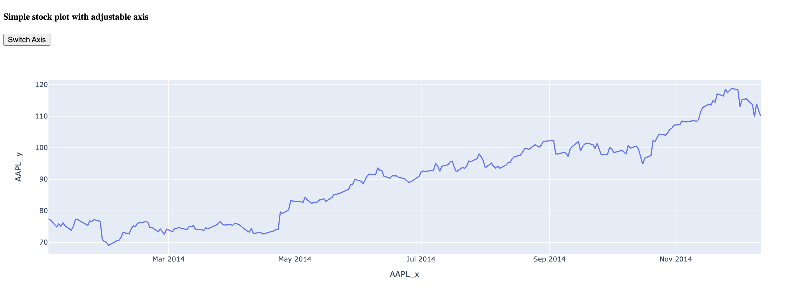
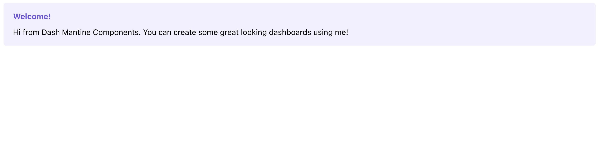

<div align="center">


<h3>
<b><i>Create, Run and Deploy Templated Plotly Dash Apps from Terminal</i></b>
</h3>

[](https://github.com/andrew-hossack/dash-tools) | [](https://pypi.org/project/dash-tools/) | [](https://pepy.tech/project/dash-tools) |  |  | 

<hr>

</div>

## **About**

[**dashtools**](https://github.com/andrew-hossack/dash-tools) is an open-source toolchain for [Plotly Dash](https://dash.plotly.com/introduction). With a user-friendly command line interface, creating Dash applications and deploying them to [Heroku](https://heroku.com/) has never been quicker.

Includes user and developer-friendly app templates where generating a new app only takes seconds. In fact, it will take longer to install this tool than it will to use it!

## **Installation**

Ready to use **dashtools**? Installation is easy with pip:

```bash
pip install dash-tools
```

[Find dash-tools on PyPi](https://pypi.org/project/dash-tools/)

#### Requires:

- **Heroku CLI** which can be downloaded [Here](https://devcenter.heroku.com/articles/heroku-cli#install-the-heroku-cli)
- **Git CLI** which can be downloaded [Here](https://git-scm.com/downloads)
- **OS** - Linux, MacOS, Windows currently supported

## **Usage Examples**

### A. Create an App

1. Create a Dash project in a new directory called "MyDashApp" (using your terminal or command prompt):
   <details>
     <summary>Note</summary>
     "MyDashApp" can be changed to any name. However, for the purpose of this tutorial, we recommend keeping it as "MyDashApp".
   </details>

   ```bash
   dashtools init MyDashApp
   ```

2. Open the default `app.py` file that comes with this project:
   <details>
     <summary>Windows</summary>

   ```bash
    .\MyDashApp\src\app.py
   ```

   </details>
   <details>
     <summary>Linux and Mac OS</summary>

   ```bash
    ./MyDashApp/src/app.py
   ```

   </details>

3. Replace the code in `app.py` with your own app code. Make sure to keep the `server = app.server` right after app instantiation:


4. Make sure you are in your project's root directory:

   ```bash
   cd MyCSVApp
   ```

5. Run your app to ensure it works:

   ```bash
   dashtools run
   ```

#### Deploy App to Web with Heroku

6. Deploy to Heroku:

   ```bash
   dashtools heroku --deploy
   ```


### B. Create an App with Local CSV sheet

A common use for Dash is to display CSV data that is located inside the project folder. For this, you can use the CSV Dash-tools template to create a project with CSV data.

1. Using App template with CSV

   ```bash
   dashtools init MyCSVApp csv
   ```

2. Replace the code in `app.py` with your own app's code, like shown in **example A** above. Make sure to keep code lines 13, 26, and 27.

   - 13: `server = app.server`
   - 26: `PATH = pathlib.Path(__file__).parent`
   - 27: `DATA_PATH = PATH.joinpath("data").resolve()`

3. Replace the default CSV file in the `data` folder with your own CSV file

4. Make sure you are in your project's root directory:

   ```bash
   cd MyCSVApp
   ```

5. Run your app to ensure it works:

   ```bash
   dashtools run
   ```

#### Deploy App to Web with Heroku

6. Deploy to Heroku:

   ```bash
   dashtools heroku --deploy
   ```

---

## **Templates**

Templates contain boilerplate code for Dash projects, making it much easier to start with useful baseline apps.

### **Using Templates**

Use the optional template argument with the `init` command:

    dashtools init <appname> [template]

The following example will create a new app "MyWonderfulApp" (you can name your app anything) using the 'tabs' template (or any other template listed below):

```bash
dashtools init MyWonderfulApp tabs
```

To list out available templates, use the `templates --list` command:

```bash
dashtools templates --list
```

### **Available Templates**

_Click the dropdowns below to see screenshots!_

<details><summary>Template: 'advanced'</summary>

_To use this template, type: `dashtools init MyFuturisticApp advanced`_

Advanced multi-page template. Includes examples of ClientsideCallbacks, multi-page routing, external stylesheets, header, footer, and 404 page.


</details>

<details><summary>Template: 'csv'</summary>

_To use this template, type: `dashtools init MyCSVLoaderApp csv`_

Example of CSV file loading. Includes the default CSV load example from Plotly.


</details>

<details><summary>Template: 'default'</summary>

_To use this template, type: `dashtools init MyAmazingApp default`_

Basic Dash template. See [Dash Docs](https://dash.plotly.com/layout)


</details>

<details><summary>Template: 'iris'</summary>

_To use this template, type: `dashtools init MyFantasticApp iris`_

Iris theme. See [Faculty.ai Example](https://dash-bootstrap-components.opensource.faculty.ai/examples/iris/)


</details>

<details><summary>Template: 'mantine'</summary>

_To use this template, type: `dashtools init MyGreatApp mantine`_

Basic mantine template. See [Dash Mantine](https://www.dash-mantine-components.com/)


</details>

<details><summary>Template: 'multipage'</summary>

_To use this template, type: `dashtools init MyPristineApp multipage`_

New multipage theme. See [Multipage Plugin](https://github.com/plotly/dash-labs/blob/main/docs/08-MultiPageDashApp.md)


</details>

<details><summary>Template: 'sidebar'</summary>

_To use this template, type: `dashtools init MySnazzyApp sidebar`_

Sidebar theme. See [Faculty.ai Example](https://dash-bootstrap-components.opensource.faculty.ai/examples/simple-sidebar/)


</details>

<details><summary>Template: 'tabs'</summary>

_To use this template, type: `dashtools init MyBeautifulApp tabs`_

Tabs theme with dynamically generated content. See [Faculty.ai Example](https://dash-bootstrap-components.opensource.faculty.ai/examples/graphs-in-tabs/)


</details>

## **Commands**

### Usage:

    dashtools <command> [options]

### Commands and Options:

- **`heroku`** Handle Heroku deployment. Choose option:
  - **`--deploy`** Deploys the current project to Heroku
  - **`--update [remote name (OPTIONAL)]`** Push changes to existing Heroku remote
- **`init <app name> [template (OPTIONAL)]`** Create a new app
  - **`--dir, -d`** Specify alternative create location
- **`run`** Run app locally from the current directory
- **`templates`** List and create templates
  - **`--init <directory to convert>`** Creates a template from specified directory
  - **`--list`** List available templates

### Other Options:

- **`--help, -h`** Display help message
- **`--version, -v`** Display version

## **Troubleshooting Common Issues**

Running into issues? Outlined below are common errors and solutions. If you do not find an answer below, please [Submit an Issue Ticket](https://github.com/andrew-hossack/dash-tools/issues).

### **Common `init` Issues**

<details><summary>No write permission</summary>

_Problem:_ You receive a 'write permission' error while trying to init a new app

_Solution:_ Please check your write permissions for the current directory. Try the init command from a different directory.

</details>

### **Common `heroku --deploy` Issues**

<details><summary>Error when creating requirements.txt file</summary>

_Problem:_ You encounter an error when generating a requirements.txt file

_Solution:_ Verify that you are running the `dashtools heroku --deploy` command from a valid plotly dash app directory. E.g. there is a `src/app.py` file.

</details>

## **Development**

See the [Developer Guide](CONTRIBUTING.md) for more details.

## **License**

MIT License. See LICENSE.txt file.
