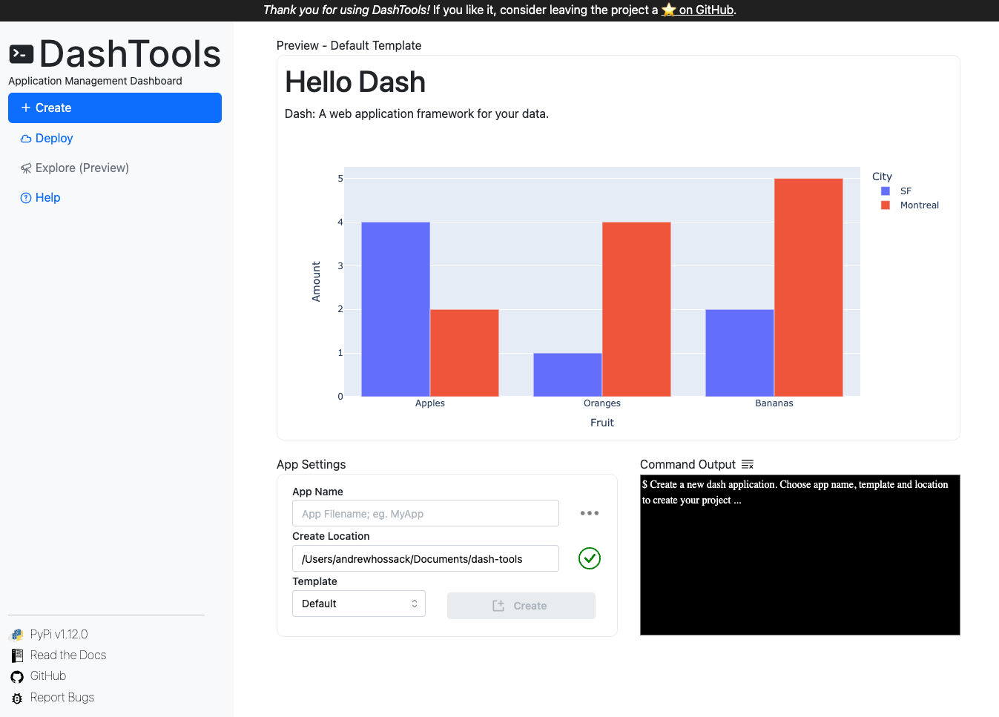

<div align="center">


<h3>
<b><i>Create, Run and Deploy Plotly Dash Apps from Terminal</i></b>
</h3>


[](https://github.com/andrew-hossack/dash-tools) | [](https://pypi.org/project/dash-tools/) | [](https://pepy.tech/project/dash-tools) | 

## [👉 Visit the Official DashTools Docs Site 👈](https://dash-tools.readthedocs.io/en/latest/index.html)

</div>



DashTools is an open-source command line toolchain for Plotly Dash that makes creating and deploying dash projects to Heroku intuitive and easy.

## Use dashtools to...

- **Create templated dash apps** with one command
- **Deploy your app** to Heroku and Render.com in under a minute
- **Generate Procfile, requirements.txt and runtime.txt** automatically on deploy
- **Many boilerplate templates** for creating apps
- **Dockerize your app** in a single step

## Get started

Install with:

```bash
pip install dash-tools
```

Run the dashboard with:

```bash
dashtools run
```

Create projects with:

```bash
dashtools init <app name>
```

<div align="center">

## [👉 Get Started With DashTools 👈](https://dash-tools.readthedocs.io/en/latest/getting%20started.html)

</div>