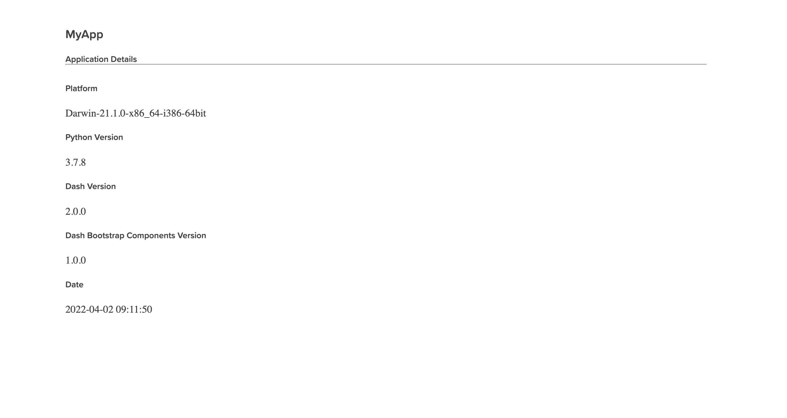

# dash-tools - An Open-Source Plotly Dash CLI Toolchain

Create a templated multi-page [Plotly Dash](https://plotly.com/dash/) app with CLI in less than 7 seconds!


## About

[dash-tools](https://github.com/andrew-hossack/dash-tools) is an open-source toolchain for [Plotly Dash Framework](https://dash.plotly.com/introduction). With a user-friendly command line interface, creating Dash applications will never be quicker.

With user and developer-friendly templates, generating a new app only takes seconds. In fact, it will take longer to install this tool than it will to use it!

## Installation

Installation is easy with pip:

```bash
pip install dash-tools
```

Find [dash-tools on PyPi](https://pypi.org/project/dash-tools/)

## Examples

Below are common usage examples. See _Commands_ section for more details.

```bash
# Create a new Dash app called MyDashApp
dash-tools --init MyDashApp
```

Templates are also available using the optional template argument after --init:

```bash
# Create a new Dash app called MyDashApp using 'minimal' theme
dash-tools --init MyDashApp minimal
```

To list out available templates, use the --templates command:

```bash
# Display available templates
dash-tools --templates

>>> dash-tools: templates: List of available templates:
>>> default
>>> minimal
>>> heroku
```

## Templates

Listed below are available project template templates. Please see the above example on how to use templates.

- **default** - the default multi-page template. Includes examples of ClientsideCallbacks, multi-page routing, external stylesheets, header, footer, and 404 page.
  
- **minimal** - for the minimalists. Not much here but the bare bones.
  
- **heroku** - Build for deployment with Heroku. Includes necessary deploy files. Built on the minimal template.
  

If you would like to develop templates, please read the _Creating Templates_ section below.

## Commands

### Project Commands

- **`--init, -i` Args: REQUIRED (`project name`) OPTIONAL (`template`) :** Creates a Plotly Dash app with the given name in the current working directory. Optional args specified can be used for templates.
- **`--templates` :** List available templates.

### Other

- **`--help, -h`:** Display CLI helpful hints
- **`--version`:** Display current version.

## Development

### Creating Templates

1. Templates are found here: `dash_tools/templating/templates/<Template Name>`. When a user uses CLI to choose a template with the name `<Template Name>` the template will be copied to their system.
2. Adding a new template to the templates directory requires adding the new template to the Enum list in `templating.templateUtils:Templates` Enum. Template name must match Enum value, eg.

   ```python
   class Templates(Enum):
      DEFAULT = 'default'
      MINIMAL = 'minimal'
      NEWTEMPLATE = 'newtemplate'
   ```

3. Any file names or files containing the strings `{appName}` or `{createTime}` will be formatted with the given app name and creation time. Eg. _README.md.template_: `# Created on {createTime}` will copy to the user's filesystem as _README.md_: `# Creaded on 2022-03-30 22:06:07`
4. All template files must end in `.template`

## License

MIT License. See LICENSE.txt file.
