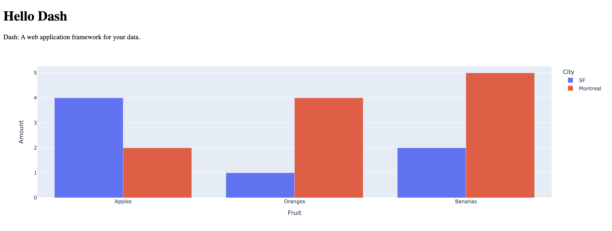
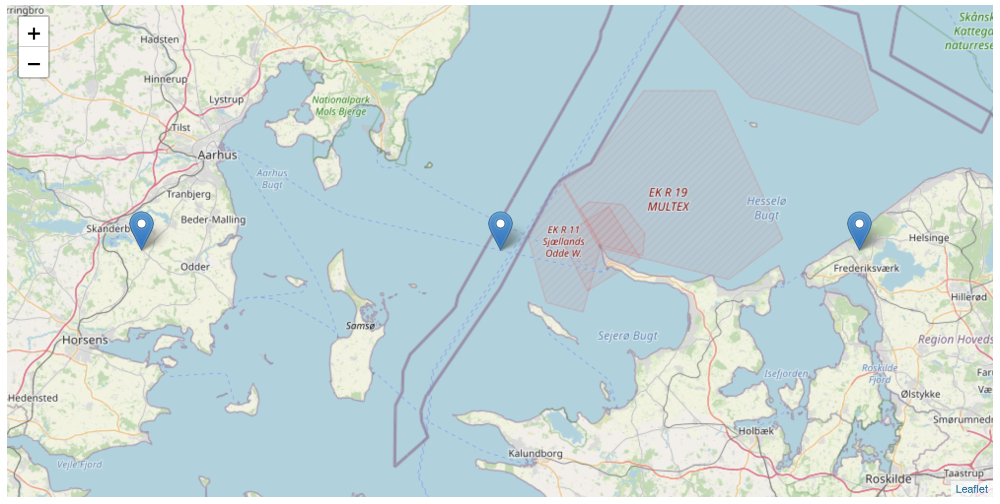
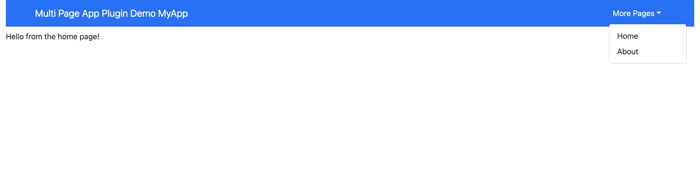

<div align="center">


<h3>
<b><i>Create, Run and Deploy Templated Plotly Dash Apps from Terminal</i></b>
</h3>

[](https://github.com/andrew-hossack/dash-tools) | [](https://pypi.org/project/dash-tools/) | [](https://pepy.tech/project/dash-tools) |  | 

</div>

## **About**

[**DashTools**](https://github.com/andrew-hossack/dash-tools) is an open-source command line toolchain for [Plotly Dash](https://dash.plotly.com/introduction) that makes creating and deploying dash projects to [Heroku](https://heroku.com/) intuitive and easy.

### Key Features

- Deploy your app to Heroku with one command
- Create an initial deploy-ready dash app template with one command
- Many different included templates for creating apps:
  - Tabs
  - Sidebar
  - Multipage
  - CSV Loading
  - ... And Many More!

### Table of Contents

- [Installation](#installation)
- [Usage Examples](#usage-examples)
  - [A. Deploy an App to Heroku](#a-deploy-an-app-to-heroku)
  - [B. Create an App](#b-create-an-app)
  - [C. Create an App with Local CSV sheet](#c-create-an-app-with-local-csv-sheet)
  - [D. Additional Examples](#d-additional-examples)
- [Templates](#templates)
  - [Available Templates](#available-templates)
  - [Format](#format)
- [Commands](#commands)
- [Troubleshooting](#troubleshooting)
- [Development](#development)
- [License](#license)

---

## **Installation**

Ready to use **dashtools**? Installation is easy with pip:

```bash
pip install dash-tools
```

> [Find dash-tools on PyPi](https://pypi.org/project/dash-tools/)

#### Requires:

- **Git CLI** - [Download Here](https://git-scm.com/downloads)
- **Heroku CLI** - [Download Here](https://devcenter.heroku.com/articles/heroku-cli#install-the-heroku-cli)
- **OS** - Linux, MacOS, Windows
- **Python Version** ≥ 3.6

---

## **Usage Examples**

### A. Deploy an App to Heroku

> Note: If your app includes data files such as CSV, make sure to follow Usage Example [C. Create an App with Local CSV sheet](#c-create-an-app-with-local-csv-sheet)

1. Make sure you are in your project's root directory. Replace "MyApp" below with the top-level directory name of your app:

   ```bash
   cd MyApp
   ```

2. Verify that your app is ready to be deployed to Heroku:

- Your project contains an **app.py** file

- Your **app.py** file has a server declaration:

  ```bash
  # 'app = Dash(...)' is declared above
  server = app.server
  ```

- Verify that running your app locally produces no errors

3. Deploy to Heroku:

   ```bash
   dashtools heroku --deploy
   ```

### B. Create an App

1. Create a Dash project in a new directory called "MyDashApp" (using your terminal or command prompt):
   <details>
     <summary>Note</summary>
     "MyDashApp" can be changed to any name. However, for the purpose of this tutorial, we recommend keeping it as "MyDashApp".
   </details>

   ```bash
   dashtools init MyDashApp
   ```

2. Open the default `app.py` file that comes with this project:
   <details>
     <summary>Windows</summary>

   ```bash
    .\MyDashApp\src\app.py
   ```

   </details>
   <details>
     <summary>Linux and Mac OS</summary>

   ```bash
    ./MyDashApp/src/app.py
   ```

   </details>

3. Replace the code in `app.py` with your own app code. Make sure to keep the `server = app.server` right after app instantiation:


4. Make sure you are in your project's root directory:

   ```bash
   cd MyDashApp
   ```

5. Run your app to ensure it works:

   Linux and Mac OS

   ```bash
   python src/app.py
   ```

   Windows

   ```bash
   python src\app.py
   ```

#### Deploy App to Web with Heroku

6. Deploy to Heroku:

   ```bash
   dashtools heroku --deploy
   ```


#### Pushing App Changes to Heroku (Optional)

7. If you make changes to your app after deploying it, push them to Heroku using:

   ```bash
   dashtools heroku --update
   ```

### C. Create an App with Local CSV sheet

A common use for Dash is to display CSV data that is located inside the project folder. For this, you can use the CSV DashTools template to create a project with CSV data.

1. Using App template with CSV

   ```bash
   dashtools init MyCSVApp csv
   ```

2. Replace the code in `app.py` with your own app's code, like shown in **example A** above. Make sure to keep code lines 5, 13, 14, 15, and 16.

   - 05: `import pathlib`
   - 13: `server = app.server`
   - 14: `PATH = pathlib.Path(__file__).parent`
   - 15: `DATA_PATH = PATH.joinpath("data").resolve()`
   - 16: `df = pd.read_csv(DATA_PATH.joinpath("YourCsvFileName.csv"))`

3. Replace the default CSV file in the `data` folder with your own CSV file

4. Make sure you are in your project's root directory:

   ```bash
   cd MyCSVApp
   ```

5. Run your app to ensure it works:

   Linux and Mac OS

   ```bash
   python src/app.py
   ```

   Windows

   ```bash
   python src\app.py
   ```

#### Deploy App to Web with Heroku

6. Deploy to Heroku:

   ```bash
   dashtools heroku --deploy
   ```

#### Pushing App Changes to Heroku (Optional)

7. If you make changes to your app after deploying it, push them to Heroku using:

   ```bash
   dashtools heroku --update
   ```

### D. Additional Examples

- [Charming Data Tutorial - Easiest Way to Deploy a Dash App to the Web](https://www.youtube.com/watch?v=Gv910_b5ID0)
- [Tutorial - Making Changes and Deploying to Heroku](docs/Configuring-Your-App.md)

---

## **Templates**

Templates contain boilerplate code for projects, making it much easier to start with useful baseline apps. Example A shown above uses the "default" template, as no template argument was specified. Example B shown above uses the "csv" template.

### Available Templates

1. To list out available templates, use the `templates --list` command:

   ```bash
   dashtools templates --list
   ```

   _Click the dropdowns below to see screenshots._

   <details><summary>Template: 'advanced'</summary>

   _To use this template, type: `dashtools init MyFuturisticApp advanced`_

   Advanced multi-page template. Includes examples of ClientsideCallbacks, multi-page routing, external stylesheets, header, footer, and 404 page.
   

   </details>

   <details><summary>Template: 'csv'</summary>

   _To use this template, type: `dashtools init MyCSVLoaderApp csv`_

   Example of CSV file loading. Includes the default CSV load example from Plotly.
   

   </details>

   <details><summary>Template: 'default'</summary>

   _To use this template, type: `dashtools init MyAmazingApp default`_

   Basic Dash template. See [Dash Docs](https://dash.plotly.com/layout)
   

   </details>

   <details><summary>Template: 'fastdash'</summary>

   _To use this template, type: `dashtools init StellarDashApp fastdash`_

   Fast Dash template. See [Fast Dash Docs](https://fastdash.app/)
   

   </details>

   <details><summary>Template: 'iris'</summary>

   _To use this template, type: `dashtools init MyFantasticApp iris`_

   Iris theme. See [Faculty.ai Example](https://dash-bootstrap-components.opensource.faculty.ai/examples/iris/)
   

   </details>

   <details><summary>Template: 'leaflet'</summary>

   _To use this template, type: `dashtools init BestMapApp leaflet`_

   Dash leaflet plugin. See [Dash Leaflet](https://github.com/thedirtyfew/dash-leaflet)
   

   </details>

   <details><summary>Template: 'mantine'</summary>

   _To use this template, type: `dashtools init MyGreatApp mantine`_

   Basic mantine template. See [Dash Mantine](https://www.dash-mantine-components.com/)
   

   </details>

   <details><summary>Template: 'multipage'</summary>

   _To use this template, type: `dashtools init MyPristineApp multipage`_

   New multipage theme. See [Multipage Plugin](https://github.com/plotly/dash-labs/blob/main/docs/08-MultiPageDashApp.md)
   

   </details>

   <details><summary>Template: 'sidebar'</summary>

   _To use this template, type: `dashtools init MySnazzyApp sidebar`_

   Sidebar theme. See [Faculty.ai Example](https://dash-bootstrap-components.opensource.faculty.ai/examples/simple-sidebar/)
   

   </details>

   <details><summary>Template: 'tabs'</summary>

   _To use this template, type: `dashtools init MyBeautifulApp tabs`_

   Tabs theme with dynamically generated content. See [Faculty.ai Example](https://dash-bootstrap-components.opensource.faculty.ai/examples/graphs-in-tabs/)
   

   </details>

2. To use a certain template, simply choose a directory name, followed by one of the template names listed above. Here, we will choose "tabs":

   ```bash
   dashtools init MyWonderfulApp tabs
   ```

3. Follow the steps in Example A to replace default app with your own app and deploy to heroku.

### Format

Templates may include different components, modules and layouts. They have the following format:

```
AppName
│-- Procfile
│-- README.md
│-- requirements.txt [1]
│-- runtime.txt
│
└── src
    |-- app.py
    |-- __init__.py
    |-- assets/      [2]
    |-- containers/  [2]
    |-- components/  [2]
    └-- data/        [2]
```

**[1]** _Created during deployment_

**[2]** _Not included in all templates_

---

## **Commands**

### Usage

    dashtools <command> [options]

### Commands and Options

- **`heroku`** Handle Heroku deployment. Choose option:
  - **`--deploy`** Deploys the current project to Heroku
  - **`--update [remote name (OPTIONAL)]`** Push changes to existing Heroku remote
- **`init <app name> [template (OPTIONAL)]`** Create a new app
  - **`--dir, -d`** Specify alternative create location
- **`run`** Run app locally from the current directory
  - **`--set-python-shell-cmd`** Specify the python shell command, e.g. python3 or python3.exe, etc.
- **`templates`** List and create templates
  - **`--init <directory to convert>`** Creates a template from specified directory
  - **`--list`** List available templates

### Other Options

- **`--help, -h`** Display help message
- **`--version, -v`** Display version

---

## **Troubleshooting**

Running into issues? Outlined below are common errors and solutions. If you do not find an answer below, please [Submit an Issue Ticket](https://github.com/andrew-hossack/dash-tools/issues/new/choose).

<details><summary>Common heroku --deploy Issues</summary>

<details><summary>&ensp;&ensp;&ensp;&ensp;Error when creating requirements.txt file</summary>

_Problem:_ You encounter an error when generating a requirements.txt file

_Solution:_ Verify that you are running the `dashtools heroku --deploy` command from a valid plotly dash app directory. E.g. there is a `src/app.py` file.

</details>

<details><summary>&ensp;&ensp;&ensp;&ensp;No webpage displayed after Heroku deployment, no error messages</summary>

_Problem:_ You are able to deploy your project online to Heroku, but nothing is displayed on the page

_Solution1:_ This may be due to missing libraries that your app needs to run successfully. Check the requirements.txt. file.

_Solution2:_ This may due to the fact that you forgot to add `server = app.server` to you main app.py file

</details>

<details><summary>&ensp;&ensp;&ensp;&ensp;Procfile is incorrect</summary>

_Problem:_ When deploying, you get an error "Procfile is incorrect"

_Solution:_ When deploying an app, the Procfile is checked for validity. Make sure that your Procfile points to the correct server entrypoint, e.g. `server = app.server`.

</details>
   
<details><summary>&ensp;&ensp;&ensp;&ensp;No solution found</summary>

_Solution:_ Try typing into the terminal or command prompt `heroku logs --tail`. This will give you access to the official heroku logs of your app that enable monitoring your stack error troubleshooting

</details>

</details>

<details><summary>Common heroku --update Issues</summary>

<details><summary>&ensp;&ensp;&ensp;&ensp;Your account has reached its concurrent build limit.</summary>

_Problem:_ When you try to update and redeploy your app to Heroku too many times within 10 minutes, you will get the above error message

_Solution:_ First, wait a few minutes and try again. If that doesn't work, check out a few possible solutions [in this thread](https://stackoverflow.com/questions/47028871/heroku-your-account-has-reached-its-concurrent-build-limit).

</details>

<details><summary>&ensp;&ensp;&ensp;&ensp;Unable to update heroku app</summary>

_Problem:_ When you try to update your app, you get an error "Unable to update heroku app. Is the project already deployed?"

_Solution:_ Make sure you have already run `git init` in the project root directory, and that you have already followed steps to deploy your project to heroku with `dashtools heroku --deploy`

If both of these steps do not work, verify that the `heroku` remote was added by running `git remote`. If you do not see it, try re-deploying your app or manually push to the correct remote with the `dashtools heroku --update <remote>` option, where `<remote>` is replaced with the correct remote.

</details>

</details>

<details><summary>Common init Issues</summary>

<details><summary>&ensp;&ensp;&ensp;&ensp;No write permission</summary>

_Problem:_ You receive a 'write permission' error while trying to init a new app

_Solution:_ Please check your write permissions for the current directory. Try the init command from a different directory.

</details>

</details>

<details><summary>Common run Issues</summary>

<details><summary>&ensp;&ensp;&ensp;&ensp;No valid python command found for your system</summary>

_Problem:_ You encounter an error: No valid python command found for your system when trying to run your app

_Solution:_ Set the python shell command with "dashtools run --set-python-shell-cmd <command>". The correct command will be the python command that runs python, eg. python, python.exe, python3, python3.exe on your system. Note that although you may be able to run 'python' from your terminal, this may be an alias command for your terminal, and not the correct command.

</details>

<details><summary>&ensp;&ensp;&ensp;&ensp;No such file or directory</summary>

_Problem:_ You encounter an error: 'No such file or directory' when trying to `dashtools run` your app

_Solution:_ Verify that you are running the `dashtools run` command from within a valid project root directory. Your app must be named `app.py`, or have a valid Procfile pointing to the app file.

</details>

<details><summary>&ensp;&ensp;&ensp;&ensp;Invalid Procfile</summary>

_Problem:_ When you try to run, you get an error "Invalid Procfile"

_Solution:_ When you run an app, the Procfile is checked for validity. Make sure that your Procfile points to the correct server entrypoint, e.g. `server = app.server`.

</details>

</details>

## **Development**

See the [Developer Guide](CONTRIBUTING.md) for more details.

## **License**

MIT License. See LICENSE.txt file.
